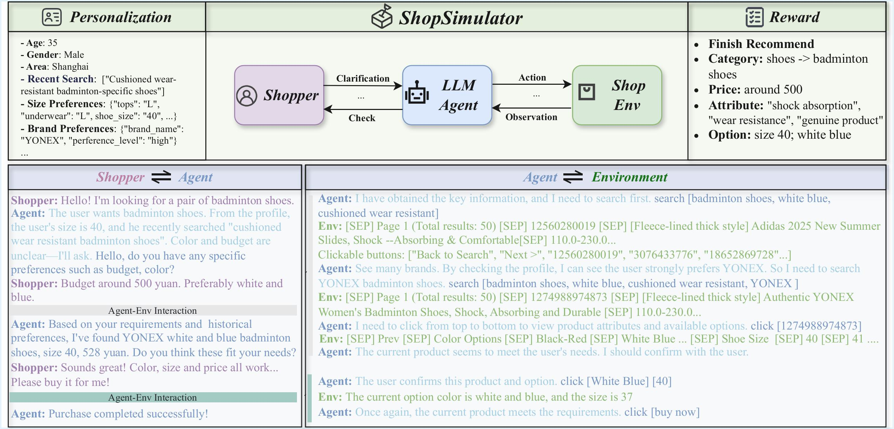

<div align="center">
  
<h1>ShopSimulator</h1>
</div>

<div align="center">
<p style="font-size: 1.1em; color: #555; margin-top: 0.5em; margin-bottom: 1.5em;">Evaluating and Exploring RL-Driven LLM Agent for Shopping Assistants</p>
</div>


<p align="center">
<a href="https://arxiv.org/abs/2601.18225">
  
</a>
<a href="https://huggingface.co/datasets/wpei/ShopSimulator">
  
</a>
<a href="https://github.com/ShopAgent-Team/ShopSimulator">
  
</a>
<a href="">
  
</a>
</p>
  
<br>

## 🎯 Abstract

Large language model (LLM)‑based agents are increasingly deployed in e‑commerce shopping. 
To perform thorough, user‑tailored product searches, agents should interpret personal preferences, engage in multi‑turn dialogues, and ultimately retrieve and discriminate among highly similar products. However, existing research has yet to provide a unified simulation environment that consistently captures all of these aspects, and always focuses solely on evaluation benchmarks without training support. In this paper, we introduce ShopSimulator, a large‑scale and challenging Chinese shopping environment. Leveraging ShopSimulator, we evaluate LLMs across diverse scenarios, finding that even the best‑performing models achieve less than 40\% full‑success rate. Error analysis reveals that agents struggle with deep search and product selection in long trajectories, fail to balance the use of personalization cues, and to effectively engage with users. Further training exploration provides practical guidance for overcoming these weaknesses, with the combination of supervised fine‑tuning (SFT) and reinforcement learning (RL) yielding significant performance improvements.

---
## 📋 Directory Structure

```
ShopSimulator/
├── shop_env/                # Shopping environment module
│   ├── shop_env/            # Environment core code
│   ├── search_engine/       # Search engine and indexing
│   ├── web_agent_site/      # Web Agent site
│   └── data/                # Data files
├── single_eval/             # Single-turn evaluation module
│   ├── agent.py             # Agent implementation
│   ├── env.py               # Environment wrapper
│   ├── configs/             # Configuration files
│   │   ├── standard/       # Standard evaluation configs
│   │   └── persona/         # Persona evaluation configs
│   ├── outputs/             # Evaluation results
│   │   ├── standard/       # Standard evaluation results
│   │   └── persona/        # Persona evaluation results
│   └── scripts/             # Run scripts
├── multi_eval/              # Multi-turn evaluation module
│   ├── agent.py             # Agent implementation
│   ├── shopper.py           # Shopper simulator
│   ├── env.py               # Environment wrapper
│   ├── configs/             # Configuration files
│   │   ├── standard/       # Standard evaluation configs
│   │   └── persona/        # Persona evaluation configs
│   ├── outputs/             # Evaluation results
│   │   ├── standard/       # Standard evaluation results
│   │   └── persona/        # Persona evaluation results
│   └── scripts/             # Run scripts
└── get_score.py             # Evaluation results statistics script
```

---

## 🚀 Quick Start


### Setup Shopping Environment

First，fire up the shopping environment:

```bash
cd shop_env
pip install -r requirements.txt
sh setup.sh

# Start the shopping environment service
python shop_env/pack_api.py
```

Once started, the environment service will be ready at `http://127.0.0.1:5000` 🎉


### Single-Turn Evaluation

Perfect for testing basic operational capabilities! This mode focuses on the direct interaction between your Agent and the environment.

**Using scripts:**
```bash
cd single_eval
./scripts/qwen3_235b.sh              # Standard evaluation
./scripts/qwen3_235b_persona.sh     # Persona evaluation
```

**Or directly:**
```bash
cd single_eval
python agent.py --yaml_name configs/standard/qwen3_235b.yaml [--multithread] [--max_workers 4]
python agent.py --yaml_name configs/persona/qwen3_235b.yaml [--multithread] [--max_workers 4]
```

**Parameters:**

- `--yaml_name`: Path to your YAML configuration file (required)
- `--multithread`: Enable parallel execution for faster evaluation (optional)
- `--max_workers`: Number of worker threads to use (default: 4)

### Multi-Turn Evaluation

Want to test how agents handle real-world shopping scenarios? This mode features three-way interaction among Shopper, Agent, and environment, simulating actual customer-agent conversations.

**Using scripts:**
```bash
cd multi_eval
./scripts/qwen3_8b.sh                # Standard evaluation
./scripts/qwen3_8b_persona.sh        # Persona evaluation
```

**Or directly:**
```bash
cd multi_eval
python agent.py --yaml_name configs/standard/qwen3_8b.yaml [--multithread] [--max_workers 4]
python agent.py --yaml_name configs/persona/qwen3_8b.yaml [--multithread] [--max_workers 4]
```

**Configuration Example:**

```yaml
shopper_config:
  model_name: qwen3-235b-a22b-instruct-2507
  source: idealab
  system_prompt: |
    You are a simulated shopper trying to complete a product purchase task through dialogue.
    ...

env_config:
  base_url: http://127.0.0.1:5000

agent_config:
  model_name: qwen3_8b
  source: whale
  max_turns: 40
  system_prompt: |
    You are an intelligent shopping assistant Agent that needs to assist the Shopper in completing purchase objectives.
    ...
  task_nums: 1459
  output_path: outputs/standard
```

### Results Statistics

Once your evaluation completes, let's see how your agent performed:

```bash
python get_score.py
```

## Citation

Feel free to cite us if you like our work.

```bibtex
@misc{wang2026shopsimulatorevaluatingexploringrldriven,
      title={ShopSimulator: Evaluating and Exploring RL-Driven LLM Agent for Shopping Assistants}, 
      author={Pei Wang and Yanan Wu and Xiaoshuai Song and Weixun Wang and Gengru Chen and Zhongwen Li and Kezhong Yan and Ken Deng and Qi Liu and Shuaibing Zhao and Shaopan Xiong and Xuepeng Liu and Xuefeng Chen and Wanxi Deng and Wenbo Su and Bo Zheng},
      year={2026},
      eprint={2601.18225},
      archivePrefix={arXiv},
      primaryClass={cs.AI},
      url={https://arxiv.org/abs/2601.18225}, 
}

